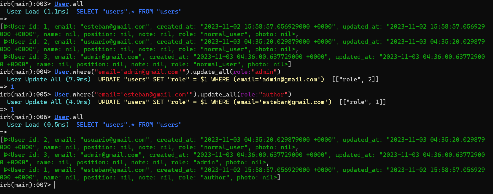

# README
Descripción
Esteban se encuentra buscando una plataforma interna de su empresa. Lo que busca
concretamente es que sus empleados puedan postular a cargos internos dentro de ella, para
poder mejorar sus rentas y poder escalar dentro de su compañía. Por ello, el cliente nos ha
contactado con el fin de desarrollar dicha plataforma. Esteban entiende que no puede pedir
todo lo que se encuentra en su cabeza para el primer desarrollo, así que nos da unas
consideraciones de lo que sí o sí debe estar para su primera entrega.
Aplicando los conceptos y herramientas aprendidas hasta ahora debes dar resolución a las
siguientes peticiones de nuestro cliente:
● Solo Esteban puede hacer publicaciones donde se ofrezca un puesto en su empresa.
● Los usuarios no pueden registrarse, el administrador, en este caso Esteban, será
quien les cree las cuentas.
● Los usuarios podrán postular a las ofertas laborales internas y le debe llegar un
mensaje a Esteban avisando de esta postulación.
● Los usuarios deben tener en su perfil su propia foto y datos relevantes sobre ellos
para que Esteban pueda determinar internamente si les da el puesto o no.
● Un usuario debe tener una pequeña pestaña con sus postulaciones.
● Cuando una visita ingresa a la aplicación, solo debe haber una imagen a elección
libre sin instrucciones y un link a ingresar a la página.
El nombre de la aplicación será determinado en un futuro, por lo que deben darle un nombre
por ahora.

Nota: 

usuario2 = esteban@gmail.com 
rol = author

usuario2 = usuario@gmail.com
rol = user

usuario3 = admin@gmail.com
rol = admin

password pata todos: la misma que ocupo en las presentaciones de las clases

evidencia

no 

Requerimientos
1. Integrar imagen con Modelado de las entidades de la aplicación.(2 Puntos)
    
2. Integrar prueba unitaria sobre el proceso de postulación de un usuario.(2 Puntos)
   no las realice.
3. Todas las imágenes deben estar alojadas en un bucket de S3.(2 Puntos)
   Nota:mis tarjetas de debito no aplican para compras internacionales, debo resolverlos
        adicionalmete a eso, no utilizare las credenciales del manual,
        pues dice explicitamente "Las claves mostradas en pantalla son claves de prueba. Cada alumno
        debe utilizar su propia clave."
        dado lo anterior, comentare los pasos a seguir, para que las imagenes sean cargadas a bucket aws

        1. instalar gema figaro
            a. bundle add figaro
            b. bundle exec figaro install

        2. Necesitamos las claves de acceso Access Key ID y Secret access Key.
        3. Agregamos las claves a nuestras variables de entorno.
            a. abrir config/application.yml
            b. añadir aws_access_key_id: 
            c. añadir aws_secret_access_key:
        4. Modificamos el archivo de configuraciones development.rb.
            a. comentar la linea de codigo (anteponer #) -> #config.active_storage.service = :local
            b. añadir linea de codigo  config.active_storage.service = :amazon
        5. Modificamos el archivo de configuraciones storage.yml y descomentamos las sgtes lineas
            Use bin/rails credentials:edit to set the AWS secrets (as aws:access_key_id|secret_access_key)
            amazon:
            service: S3
            access_key_id: <%= Rails.application.credentials.dig(:aws, :access_key_id) %>
            secret_access_key: <%= Rails.application.credentials.dig(:aws, :secret_access_key) %>
            region: us-east-1
            bucket: your_own_bucket-<%= Rails.env %>
        6. Agregamos datos del bucket a nuestras variables de entorno, archivo config/applciation.yml
            aws_bucket_name: nombre del bucket que creamos
            aws_bucket_region: region del bucket que creamos
        7. añadimos la gema S3 al proyecto y la instalamos
            a. bundle add aws-sdk-s3
            b. bundle install

        para el ambiente de produccion

        8. modificar archivo del ambiente, config/enviroments/production.rb
            a. comentar la linea de codigo (anteponer #) -> #config.active_storage.service = :local
            b. añadir linea de codigo  config.active_storage.service = :amazon

4. Solo integrar crud de usuarios y ofertas laborales.(2 Puntos)
5. La aplicación debe ser subida a heroku y proveer de datos de prueba más una cuenta
administrador y usuario normal al docente para su revisión. (2 Puntos)

        Nota: mis tarjetas de debito no me funcionaron en heroku, puedo acceder a servicios de streaming pero imposible a heroku, me rechazo todas mis tarjetas

        explico las opciones que disponemos par deloyment en heroku

        tenemos dos opciones
        1 consola

        1. realizamos login a heroku, con el comando heroku login
        2. creamos la aplicacion, con el comando heroku create
        3. subimos la aplicacion
            a. git init
            b. heroku git:remote -a nombre de tu proyecto creado en Heroku.
            c. git add .
            d. git commit -am "Feat: Primer commit to push to heroku"
            e. git push heroku main
            
        cualquier mejora o actualizacion de la app
        Dado que nuestra aplicación está enlazada a git debemos subir estos cambios,
        repitiendo el proceso de:
            a. git add .
            b. git commit -m ”Describe el cambio realizado”
            c. git push heroku main

        2 heroku + github

        1. subir a github
            a. git add .
            b. git commit -m ”Describe el cambio realizado”
            c. git push origin main (o la rama)   
            
        2. pull request
            a. con integracion continua ci/cd
            luego merge pull request
            confirm merge  -> lleva los cambios a main (github)

        3. Nota: nos traemos la app a local con toda la integracion continua (ci/cd) del paso anterior
            git checkout main
            luego git pull origin main

        4. ahora voy a heroku a crear la app
            a. 	le asigo el nombre de la app
            b. 	luego selecciono el metodo de deployment GitHub 	y lo conecto con la app que esta en github
            c. 	luego en automatic deploy, selecciono wait for CI to pass defore deploy (esperar a que termine la integracion continua en github
            d.	o voy a manual deploy, selecciono el branch  to deploy (main) y doy clic en deply branch 

